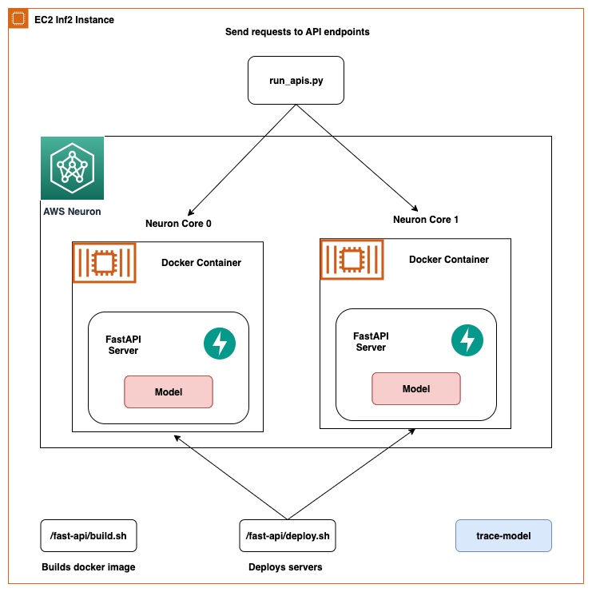
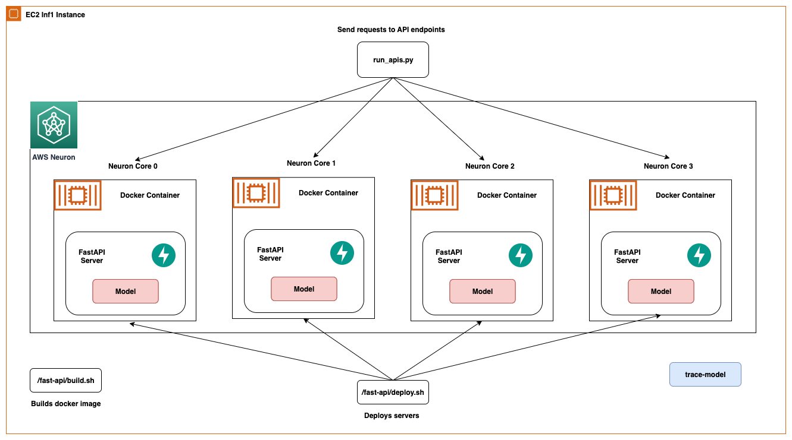
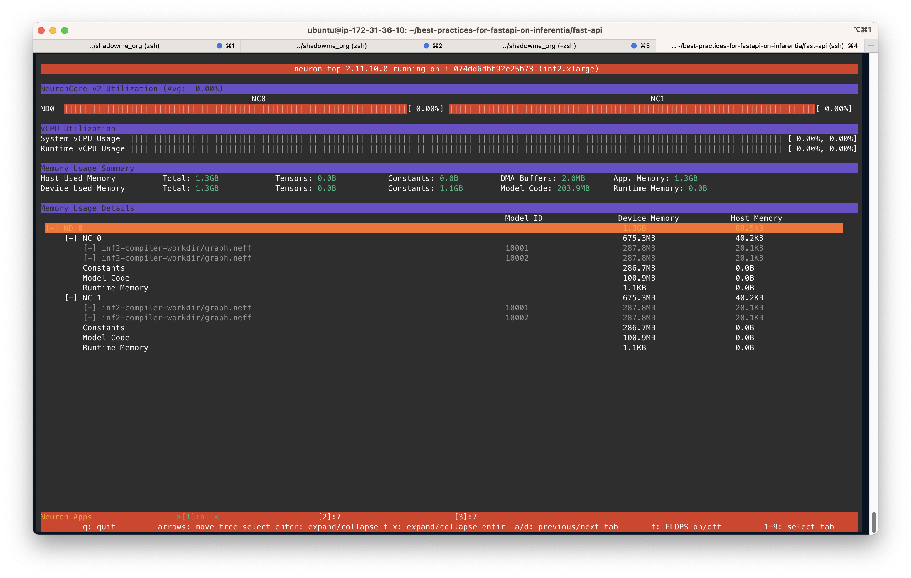
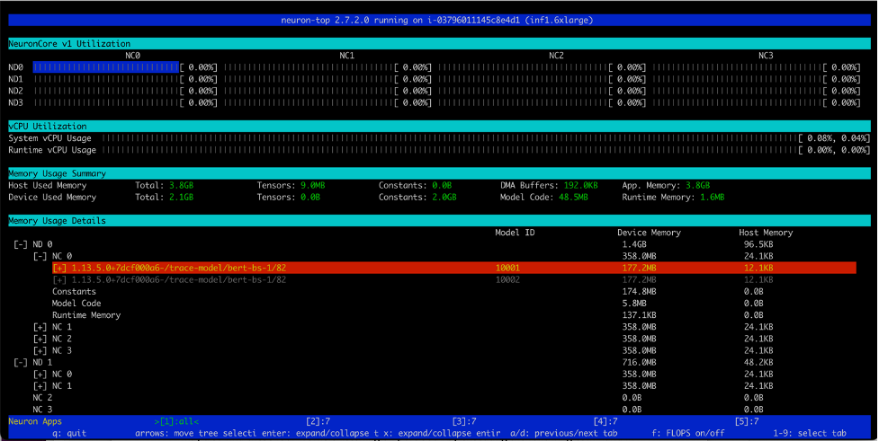
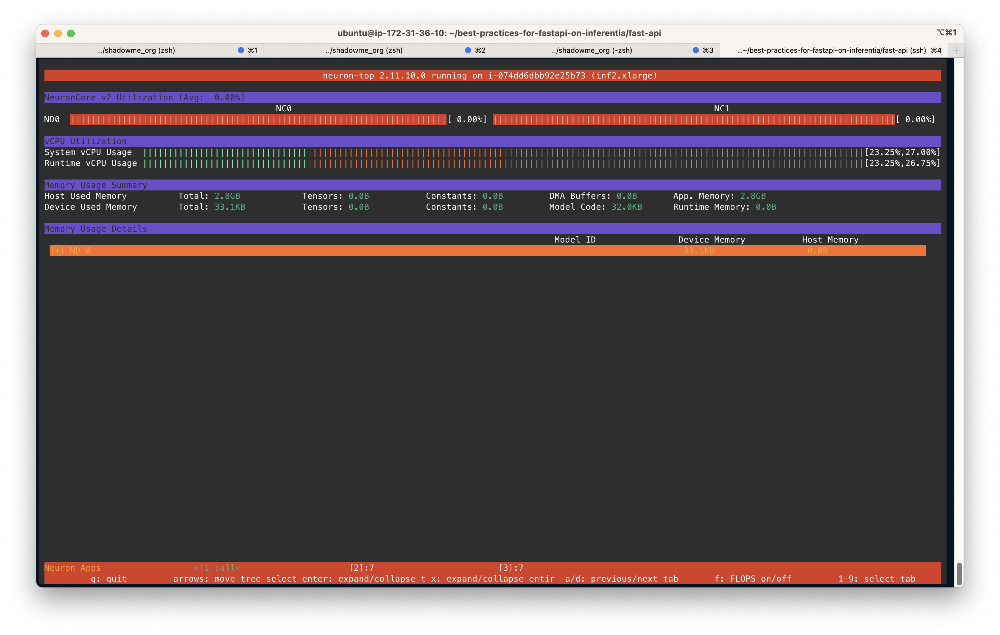
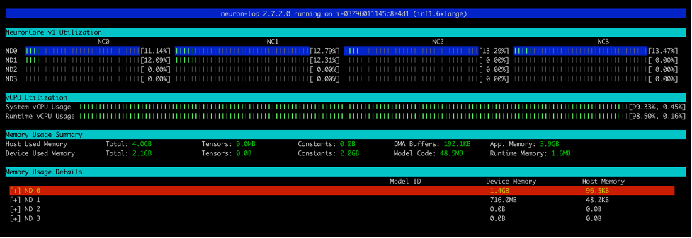

# Best Practices to Optimize Inferentia Utilization with FastAPI on Amazon EC2 Inf2 and Inf1 Instances

## 1. Overview

Production workloads often have high throughput, low latency and cost requirements. Inefficient architectures that
sub-optimally utilize accelerators could lead to unnecessarily high production costs. In this repo, we will show how to
optimally utilize NeuronCores with FastAPI to maximize throughput at minimum latency. In the following sections, we will
show to setup this solution on an Inf1 instance and will walkthrough how to compile models on NeuronCores, deploy models
with FastAPI and monitor NeuronCores. An overview of the solution architecture is depicted in Fig. 1.

<div align="center">


  <br/>
<b>Fig. 1 - Solution Architecture diagram using Amazon EC2 Inf2 instance type</b>
<br/>
<br/>

  <br/>
  
<b>Fig. 2 - Solution Architecture diagram using Amazon EC2 Inf1 instance type</b>
<br/>
<br/>
</div>
<br/>

## 2. AWS Inferentia NeuronCores

Each Inferentia chip has 4 NeuronCores available that share the system vCPUs and memory. T

he table below shows a breakdown of NeuroCore-v1 available for different Inf1 instance sizes.

| Instance Size | # Accelerators | # NeuronCores-v1 | vCPUs | Memory (GiB) |
|---------------|:--------------:|:----------------:|:-----:|:------------:|
| Inf1.xlarge   |       1        |        4         |   4   |      8       |
| Inf1.2xlarge  |       1        |        4         |   8   |      16      |
| Inf1.6xlarge  |       4        |        16        |  24   |      48      |
| Inf1.24xlarge |       16       |        64        |  96   |      19      |

Similarly, this is the breakdown of Inf2 instance types with the latest NeuronCore-v2

| Instance Size | # Accelerators | # NeuronCores-v2 | vCPUs | Memory (GiB) |
|---------------|:--------------:|:----------------:|:-----:|:------------:|
| Inf2.xlarge   |       1        |        2         |   4   |      32      |
| Inf2.8xlarge  |       1        |        2         |  32   |      32      |
| Inf2.24xlarge |       6        |        12        |  96   |     192      |
| Inf2.48xlarge |       12       |        24        |  192  |     384      |

Neuron Runtime is responsible for executing models on Neuron Devices. Neuron Runtime determines which NeuronCore will
execute which model and how to execute it. Configuration of the Neuron Runtime is controlled through the use
of [Environment variables](https://awsdocs-neuron.readthedocs-hosted.com/en/latest/neuron-runtime/nrt-configurable-parameters.html#nrt-configuration)
at the process level. Two popular environment variables are `NEURON_RT_NUM_CORES` and `NEURON_RT_VISIBLE_CORES`. You can
find a list of all environment
variables [here](https://awsdocs-neuron.readthedocs-hosted.com/en/latest/neuron-runtime/nrt-configurable-parameters.html#nrt-configuration).

<div align="center">

<br/>
<b>Fig. 3 - Key Neuron Runtime Environment Variables</b>
</div>
<br/>

## 3. EC2 Solution Setup

To setup the solution in a repeatable, reusable way we use Docker containers and provide
the [config file](https://github.com/aws-samples/best-practices-for-fastapi-on-inferentia/blob/main/config.properties)
for users to provide inputs. This configuration file needs
user defined name prefixes for Docker image and Docker containers. The `build.sh` script in
the [fastapi](https://github.com/aws-samples/best-practices-for-fastapi-on-inferentia/tree/main/fast-api)
and [trace-model](https://github.com/aws-samples/best-practices-for-fastapi-on-inferentia/tree/main/trace-model) folders
will use this to create Docker images.

Once you have provisioned an appropriate EC2 instance (with the proper IAM role to get access to ECR) clone this repository. 

Start by specifying the `CHIP_TYPE` variable (default "inf2") and the `AWS_DEFAULT_REGION` (default "us-east-2") you are working in the `.env` file. The `.env`
file will automatically figure out your ECR registry information so no need to provide it. 

Note: There are two `.env` files with the same variables. They're in the `trace-model` and `fast-api` directories. They're 
separate so that tracing and deployment can be two separate processes and can be deployed in two separate regions if need be. 

### 3.1 Compiling Models on NeuronCores

First, we need to have a model compiled with AWS Neuron to get started. In
the [trace-model]((https://github.com/aws-samples/best-practices-for-fastapi-on-inferentia/tree/main/trace-model))
folder, we provide all the scripts necessary to trace a [bert-base-uncased](https://huggingface.co/bert-base-uncased)
model on Inferentia. This script could be used for most models available on HuggingFace.
The [Dockerfile](https://github.com/aws-samples/best-practices-for-fastapi-on-inferentia/blob/main/trace-model/Dockerfile)
has all the dependencies to run models on AWS Neuron and
runs [trace-model.py](https://github.com/aws-samples/best-practices-for-fastapi-on-inferentia/blob/main/trace-model/trace-model.py)
code as entrypoint. You can build this container by simply
running [build.sh](https://github.com/aws-samples/best-practices-for-fastapi-on-inferentia/blob/main/trace-model/build.sh)
and push to ECR
with [push.sh](https://github.com/aws-samples/best-practices-for-fastapi-on-inferentia/blob/main/trace-model/push.sh).
The push script will create a repo in ECR for you and push the container image.

To make things easier, we're going to rely on
pre-built [Neuron runtime Deep Learning Docker images](https://github.com/aws/deep-learning-containers/blob/master/available_images.md)
provided by AWS.

To pull these images, we need temporary credentials.
The [fetch-credential.sh](https://github.com/aws-samples/best-practices-for-fastapi-on-inferentia/blob/main/trace-model/fetch-credentials.sh)
contains the command to pull these credentials

This is the order of commands to start compilation and then to run the images as containers.

```console
cd ./trace-model
./fetch-credential.sh
./build.sh
./run.sh
```

### 3.2 Deploying Models with FastAPI

Once models are compiled, the TorchScript model file (.pt) will land under the `trace-models` folder. For this example,
it is hard-coded as `compiled-bert-bs-1.pt` in `config.properties` file.
The [fast-api](https://github.com/aws-samples/best-practices-for-fastapi-on-inferentia/tree/main/fast-api) folder
provides all the necessary scripts to deploy models with FastAPI. To deploy the models without any changes simply
execute
the [deploy.sh](https://github.com/aws-samples/best-practices-for-fastapi-on-inferentia/blob/main/fast-api/deploy.sh)
script. This will build a fastapi container image and run containers on specified number of cores and deploy the
specified number of models per server in each FastAPI model server.

```console
cd ./fast-api
./deploy.sh
```

### 3.3 Calling APIs

Once the containers are deployed, we use
the [run_apis.py](https://github.com/aws-samples/best-practices-for-fastapi-on-inferentia/blob/main/run_apis.py) script
that calls the APIs in parallel threads. The code is set up to call 6 models deployed, 1 on each NeuronCore but can be
easily changed to a different setting.

```console
python3 run_apis.py
```

### 3.4 Monitoring NeuronCores

Once the model servers are deployed, to monitor NeuronCore utilization, we may use neuron-top to observe in real time
the utilization percentage of each
NeuronCore. [neuron-top](https://awsdocs-neuron.readthedocs-hosted.com/en/latest/tools/index.html?highlight=neuron-top&neuron-top-user-guide.html=#neuron-top-user-guide)
is a CLI tool in the Neuron SDK to provide information such as NeuronCore, vCPU and memory utilization. In a separate
terminal, enter the following command:

```console
neuron-top
```

And your output should be similar to the following figure. In this scenario, we have specified to use 2 NeuronCores and
2 models per server on an Inf2.xlarge instance. The screenshot below shows that 2 models of size 675.3MB each are
loaded on 2 NeuronCores. With a total of 2 models loaded, you can see the Device Memory Used is 1.3 GB. Use the arrow
keys to move between the NeuronCores on different devices.

<div align="center">

<br/>
Fig. 4 - Loading Models on Amazon EC2 Inf2 instance type
</div>
<br/>

Similarly this screenshot shows Inf1 instance with 6 NeuronCores and 2 models per server. Device memory used 2.1GB.

<div align="center">

<br/>
Fig. 5 - Loading Models on Amazon EC2 Inf1 instance type
</div>
<br/>

Once you
run [run_apis.py](https://github.com/aws-samples/best-practices-for-fastapi-on-inferentia/blob/main/run_apis.py) script,
you can see % utilization of each of the 2 NeuronCores as below. You can also see the System vCPU usage and Runtime vCPU
usage.

<div align="center">

<br/>
Fig. 6 - NeuronCore Utilization when calling APIs on Amazon EC2 Inf2 instance type
</div>
<br/>

The next screenshot shows the utilization on an Inf1 instance type with 6 NeuronCores.

<div align="center">

<br/>
Fig. 7 - NeuronCore Utilization when calling APIs on Amazon EC2 Inf1 instance type
</div>
<br/>

### 3.4 Clean Up

To clean up all the Docker containers created in this work, we provide
a [cleanup.sh](https://github.com/aws-samples/best-practices-for-fastapi-on-inferentia/blob/main/fast-api/cleanup.sh)
script which just removes all running and stopped containers. This script will remove all containers so don’t use it
only if you wish to keep some containers running.

```console
cd ./fast-api
./cleanup.sh
```

## Security

See [CONTRIBUTING](CONTRIBUTING.md#security-issue-notifications) for more information. Prior to any production
deployment, customers should work with their local security teams to evaluate any additional controls

## License

This library is licensed under the MIT-0 License. See the LICENSE file.

